# Data-analyst-Darvin

# Final AWS Portfolio Project Report – Darvin Joseph

## Descriptive Analysis

### Project Description
Descriptive Analysis of Employee Turnover Patterns

### Project Title
Understanding Employee Turnover Patterns at XYZ Retail

### Objective
The primary goal of this project is to conduct a descriptive analysis of customer purchase data at XYZ Retail. Through this analysis, we aim to summarize key characteristics of customer purchases, identify trends, and generate insights that can inform marketing strategies and inventory management.

### Dataset
The dataset includes structured HR exit and employee records from XYZ Corp (City of Vancouver HR Department) collected over the past 12–18 months, with the following key features:
- Employee ID: Unique identifier for each employee
- Department: Department the employee worked in (e.g., HR, Marketing, IT)
- Exit Date: Date of official departure
- Exit Type: Whether the exit was voluntary or involuntary
- Exit Reason: Categorized reason for leaving (e.g., better opportunity, retirement, conflict)
- Service Duration: Number of years/months served
- Gender: Gender identity of the employee
- Age Group: Categorized age range (e.g., 18–24, 25–34, 35–44)

### Methodology
1. **Data Collection and Preparation**:
   - Loaded employee exit datasets into Amazon S3 using a structured Datalake design.
   - Performed data cleaning using AWS DataBrew to fix invalid timestamps and missing fields.
   - Tagged and organized files by department and exit type.

2. **Descriptive Statistics**:
   - Calculated total exits and average tenure.
   - Counted exits per department/month and by type (voluntary/involuntary).
   - Analyzed gender and age distribution.

3. **Visualization**:
   - Created time series graphs of monthly exits.

4. **Employee Segmentation**:
   - Grouped by tenure: early (<1 year), mid-career (1–5 years), long-term (>5 years).
   - Compared exit reasons and voluntary/involuntary breakdowns.

5. **Insights and Findings**:
   - Peak exits in Q1 and Q4 due to fiscal cycle or performance reviews.
   - Highest turnover in HR and Marketing.
   - Voluntary exits due to lack of growth opportunities.

6. **Root Cause Analysis**:
   To better understand why employee turnover is elevated across various departments, we conducted a root cause analysis using a Fishbone (Ishikawa) diagram:]

   
 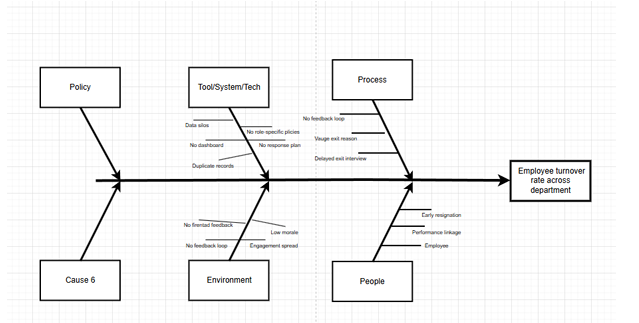

 
   This visual identifies six core categories contributing to turnover:
   - Policy gaps
   - System/tool limitations
   - Process inconsistencies
   - Low morale
   - Stress and early exits

8. **Dataset Storage Architecture**:
   The HR datasets used in this analysis were organized within a secure AWS S3 bucket named HR-raw-b. Each file was structured and tagged according to its content, access frequency, and retention policy, forming the foundation of our Datalake.
Key highlights of the storage architecture:
	- Datasets: Employee Exit Interviews and Employment Records were separated by year and quarter.
	- Tagging: Each file was tagged with Owner, ReadFreq, and DataType to assist with permissions and retrieval.
	- Storage Class: Frequently accessed data remained in Standard, while older records were transitioned to Glacier Deep     Archive for cost-efficient long-term storage.
	- Region: All files were stored in the Virginia (us-east-1) AWS Region.
This design supports secure storage, efficient access, and long-term compliance for organizational HR analytics.
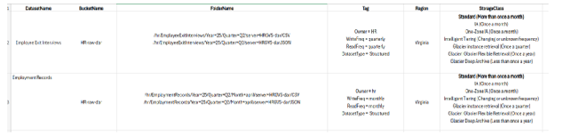

9. **Recommendations**:
   - Create retention programs for <2 year employees.
   - Improve career paths in high-turnover departments.
   - Standardize exit interviews.
   - Use dashboards for real-time trends.

---

## Tools and Technologies

- **AWS Services**: S3, EC2, DataBrew, Glue, CloudWatch, Lambda, CloudTrail
- **Data Analysis**: AWS Athena
- **Visualization**: draw.io (Fishbone, architecture)
- **Documentation**: Word, PDF, tagged datasets in S3

---

## Deliverables

- AWS Datalake with raw, clean, curated datasets
- Cleaned and profiled dataset
- Root cause Fishbone diagram
- Summary report of methodology and insights
- Visualizations by department, tenure, reason
- Stakeholder presentation deck

---

## AWS Deployment and Service Models

The case study involves a comparison between the on premise-based and AWS cloud-based work with the capital planning data store of the City of Vancouver. At the on-premises structure, data is stored on the disk servers in the local city data center and can only be equipped to the in-house workers via LAN or VPN. In-house firewalls are protecting privacy and IT policies. At the cloud scenario, the data set is a repository on virtual machines in an AWS (Virginia, in this case), and world access is supported by the IAM roles and safe sign-in. AWS is also encrypted and CloudTrail services help to monitor and perform additional security and compliance. The cloud solution generally becomes more convenient, expandable, and maintainable and it also decreases the demand of physical infrastructure.

Figure 1 Traditional vs Cloud Computing Model
 

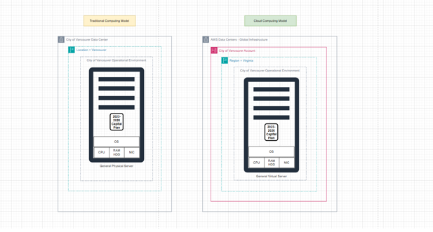

Figure 2 Comparison between Traditional vs Cloud model

 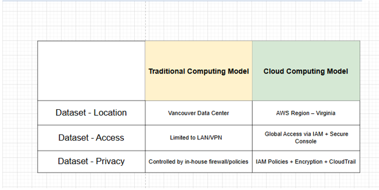

 
we discussed the main four cloud deployment models; Private Cloud, Public Cloud, Hybrid Cloud and Multi-Cloud in order to identify the best deployment model that would effectively store and manage the capital planning data both securely and reliably.

Private Cloud A Private Cloud uses data where it is stored in the data center of the city. Although, such a model allows an enterprise to have complete control over its infrastructure, high in house resources to ensure maintenance, scalability and uptime are required. To illustrate, letting the capital planning dataset be stored only on the local servers within Vancouver would reduce the reach of remote access and involve internal IT personnel when it comes to assistance and replication.

High availability, in-built redundancy, and access all over the globe are basic features attributed to the Public Cloud model, e.g. when data is deployed to AWS Infrastructure (i.e. S3 to Virginia region) it has an IAM policy that allows the data to be accessed globally. In contrast, it makes it easy to have the city rapidly provision new resources without having to manage the hardware, so it is suited to datasets where accessibility and elasticity are important open data portals or reporting dashboards.
Figure 3 Private and Public Cloud
 
A Hybrid Cloud combines the two directions. In our solution, sensitive financial data may be kept in the internal systems of the City of Vancouver, whereas transformed and anonymized data may be kept in AWS S3 so that the analysis may be conducted with the help of Glue and Athena. This architecture on the one hand facilitates data residency principles, and on the other hand allows the benefits of cloud-based scalability and insights to be exploited.

Figure 4 Hybrid Cloud Model

 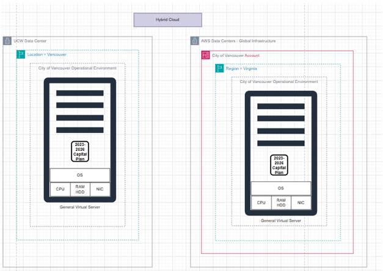

Lastly, the Multi-Cloud model goes one step further and consumes data and services provided by several cloud providers, AWS and Microsoft Azure, in particular. This also gives greater fault tolerance and avoids the vendor lock-in. As an example, data ingestion and transformation may be performed in AWS, whereas place archival or connection with the pre-existing city systems based on Microsoft might be performed in Azure.

Figure 5 Muti Cloud Model

 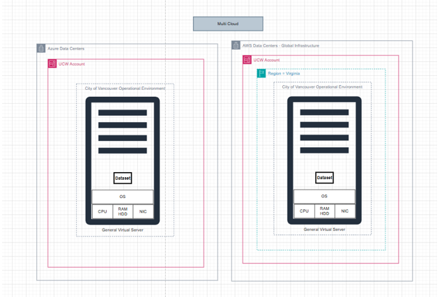

All models are strategic in maintaining balance between security, accessibility and efficiency of the operations. In the case of a project of ours which falls under the public-sector, a hybrid model provided the optimal configuration of making use of both internal control on sensitive data and cloud-based flexibility in analysis and reporting.

Figure 6 Comparison of Four Models

 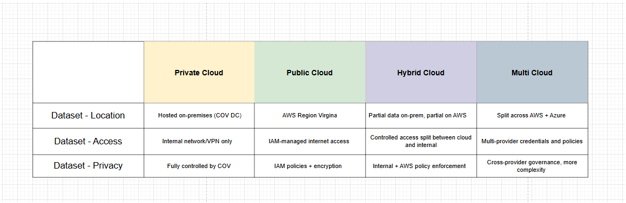

The three important models of AWS services namely; Infrastructure as a Service (IaaS), Platform as a Service (PaaS) and Software as a Service (SaaS) in relation to the process of running the 2023 2026 Capital Plan data of the City of Vancouver. In an IaaS model, virtual machines, storage and network designs can be managed in their entire component by the Registrar Operations Team, via services, like EC 2, EBS and others. This leaves much freedom and simultaneously the entire blame on the team to guard and be in charge of the infrastructure. When dealing with the PaaS mode, AWS will take the control of the previous lower level of the infrastructure and the platform level and the Registrar team will just focus on their work based on the data with the help of such tools as Glue or Athena. This reduces overheads in its operation but it is user friendly to customization. In SaaS architecture, both the entire stack i.e. Software and platform layer fall on the AWS platform and vendor and the Registrar team is left with a simple end-user to do very minimal configuration. This is the model that is easiest to use and it produces less control. Overall, migration between IaaS and SaaS could be described as a trade off between control and convenience and each of the two is going to offer to the organizations different responsibility, access and efficiency levels depending on the needs.

Figure 7 Iaas

 
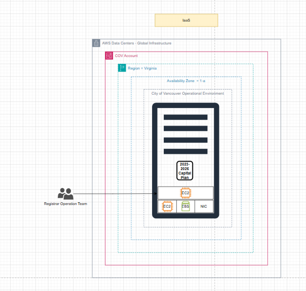

Figure 8 Paas

 

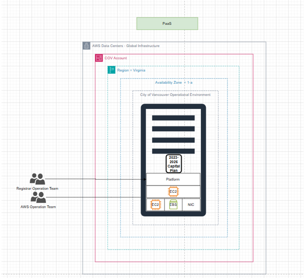

Figure 9 Saas

 
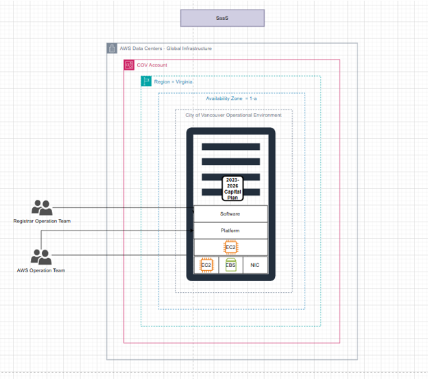

Figure 10 Comparison Table of IaaS, PaaS and Saas

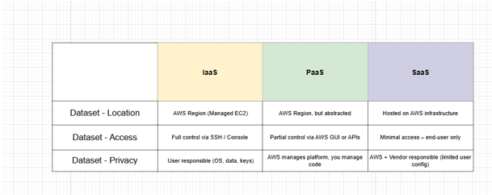

---

## AWS Cost Analysis

This module also discussed the benefits of migration of traditional on-premise infrastructures to cloud services offered by AWS in a bid by organization to cut down various operational charges and increase efficiency. TCO case study gave an example of a likes of a global firm that transitioned its entire data center on AWS, replacing 205 physical servers (90 percent reduction), migrating almost all applications to the cloud and utilizing 3-year EC2 Reserved Instances to maximize cost expenditure. The result of such migration was the quantifiable rise in the level of operational agility and the windfall of investment (ROI).
To determine how much it would cost us, we determined the S3 storage cost to host operational datasets using the AWS Pricing Calculator. When the storage costs, PUT and GET fees were added, an approximated total amount of USD 13.58 was obtained to be paid in 12 months. This was an indication of the ability of AWS to provide scaling of data storage to full cost transparency.
In the case of data quality, we used Amazon Web Services, Glue DataBrew, to profile our HR data set. The platform also helped in visualizing the existence of missing values, column types, and the problem with the distribution of data, thus enabling the transformation to be done after it was cleaned. Then we built ETL jobs on the AWS glue studio, where we designed, monitored, and stored data transformation pipelines to be analyzed further.

Figure 11 Total Cost of Ownership

 
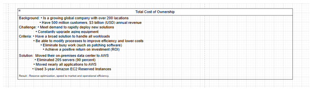

Figure 12 Data Storage Cost Evaluation

 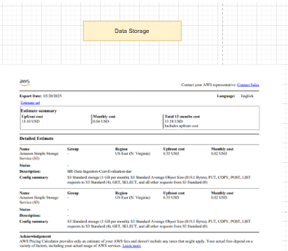

 
Figure 13 Data Profiling and Cleaning

 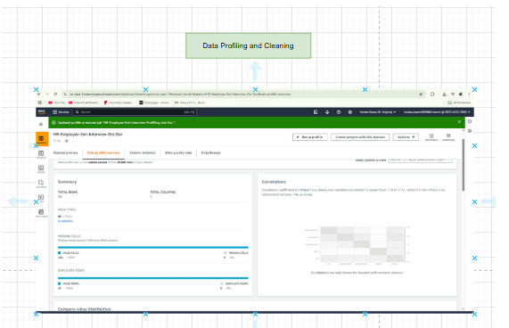

Figure 14 Data Analysis

 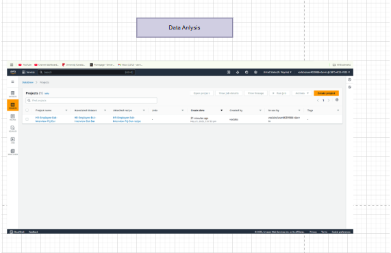

 
Finally, we have chosen the AWS Developer Support Plan at our department (City of Vancouver Data Team). It is an inexpensive service to receive technical support and detailed documentation, this is the best support tier to figure out troubleshooting Glue, data integrity using KMS and solving operational problems in either Athena or S3.

This module not only promoted the optimization of costs but it was also indicated that it is crucial to employ service option, automation, support consistency when coming up with cloud-based data platforms administration.

Figure 15 Support Plan

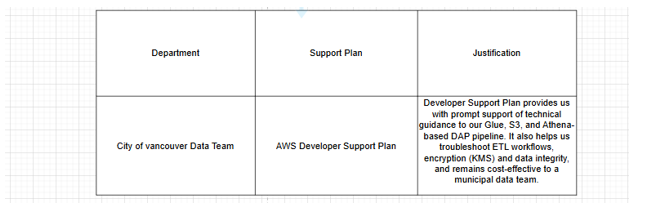

---

## AWS Global Infrastructure

A strategic approach was followed in the case of implementation of the AWS global infrastructure as the project was called City of Vancouver Data Analytics Platform (DAP) to maximize its performance, security and governance framework. The actual processing of data and custody including the related and supportive AWS services, e.g. S3, Glue and Athena, were carried out in one of the specific AWS Regions (e.g. Virginia), and the entire control through IAM policies, encryption by KMS, compliance tracking by CloudTrail was achieved. Although it has not been used in the current version in direct form, Edge Locations and Regional Edge Caches are fantastic features to use on the faces that are exposed publicly. To give an example, if one were to make the dashboards or the open datasets available in the city, it would be beneficial to have them distributed across edge locations on AWS CloudFront so as to ensure that latency is reduced on the user-side of the equation. Similarly, data that commonly happens to be read e.g reports or homogenised outputs that are CSV files would be pulled faster at regional caches at the edges without resource strain on the backend. This is a multi-layered infrastructure network that will serve to fulfill the current, internal municipal regulations regarding data management and long term planning of the city both in regard towards openness and access.
Figure 15 AWS Global Infrastructure
 
Figure 16 Case Study #7: AWS Global Infrastruture

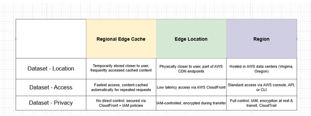

---

## AWS IAM (Module 4)

Within the framework of secure data analytics deployment in the City of Vancouver, AWS Identity and Access Management (IAM) was used to organize the access focused on the DAP workflow. This module entailed setting up of IAM roles, which matched the roles in the operation, a realistic schema in terms of information governance and security provision of CoV.
Three users of the IAM, namely user-1, user-2, and user-3 were allocated to three different users groups, which pretended job-based access into AWS services. This will be similar to the operation design at the City of Vancouver Data Team in which the principle of least privilege is firmly in place.
The user-1 was added to S3-Support so that their access to S3 was read-only. This is due to limited visibility of data thus usually provided to data auditors or quality control analysts of encrypted S3 buckets such as cov-raw-dar, cov-clean-dar, and cov-curated-dar
user-2 was added to EC2-Support group with view-only EC2 rights as it is done when temporary support staff is added, and don t process infrastructure.
user-3 belonged to the EC2-Admin group where inline policies allowed EC2 instance start and stop actions; a similar operation assigned to DAP operational engineers to manage Glue ETL jobs runtime and scaling of computer resources.
On the one hand, this case study proves the governance framework of the DAP initiative by revealing how CoV manages the role-based access control (RBAC). It is a signpost on how IAM users are restricted and carefully scoped, as encryption, key rotation (through KMS), and logging (CloudTrail) are implemented to ensure accountability and data protection of buckets and transformation pipelinesDAP_Implementation_CoV_ мира restriction and tight scoping of IAM users and encryption, key rotation (via KMS) and logging (CloudTrail) practices facilitate accountability and data protection within buckets and transformation pipelines arena restriction and careful scoping of IAM users and encryption, key rotation (through KMS) and
Lastly, the impact of IAM policy was tested on real-time by using sign-ins, where the access denial farther supported the right access limits- thus, each role performed in tasks within its job limits. The operational IAM segmentation fulfils the overall encryption, replication and monitoring approach of the DAP that CoV pursues.

Figure 17 Case Study #9: IAM practrice: Lab 1

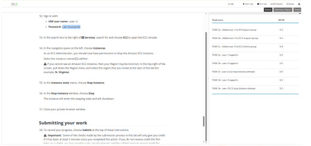
---

## AWS VPC (Module 5)

In this AWS Module 5 lab, I designed a custom Virtual Private Cloud (VPC) configuration based upon what the City of Vancouver would need with its DAP pipeline network architecture. My plan was to create both publicly exposed and privately isolated subnets in different Availability Zones that resembles a high availability configuration as we might want to isolate the Glue and Athena activity from public dashboards or APIs. The access was managed through subnet route tables and security groups, which were echoes of layered network security implemented in our project that secured raw, clean and curated S3 buckets. One EC2 instance could be successfully deployed on the public subnet, but the web application that was supposed to be served there was not accessible because of a lack of an inbound rule of the type HTTP or a web server. This lab expanded my knowledge on how to develop resilient and isolated environments on AWS, which is a major prerequisite when handling sensitive data of a municipality, and scaling analytics operations on cloud servers.

Figure 18 Module 5 Knowledge Check

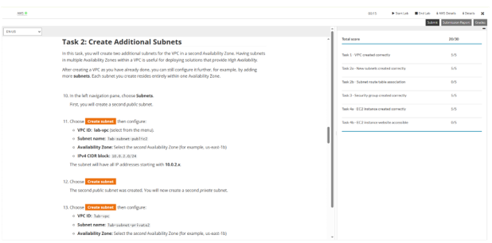
---

## AWS Lambda (Module 6)

This AWS Module 6 lab made me design and implement an automated Lambda to shut down an existing EC2 instance that was scheduled with CloudWatch. The Python code to perform the action was written based on the Boto3 libraries and the process was successful with a score of 100. This activity showed how AWS Lambda could automatically handle operations tasks that can be carried out without the need to have a manual step in routinely running application and the infrastructure being run 24x7.

This feature exactly aligns with our DAP project at the City of Vancouver, where automation is a core to the management of safe and scale-able data pipelines. An example of production DAP environment might involve using Lambda to automatically archive Glue jobs logs, replicate backups across S3 buckets in the event of a successful transformation, or notify data teams about curated data update state. Rather than on sustained infrastructure, Lambda will allow us to scale operations on the basis of triggering events-maintaining the city objective of efficient, transparent and proactive data governance. This lab restated the importance of the serverless computing as the mean to sustain clean, cost effective, highly available analytics workflows in the public sector.

Figure 19 Case Study #11: Create an AWS Lambda function

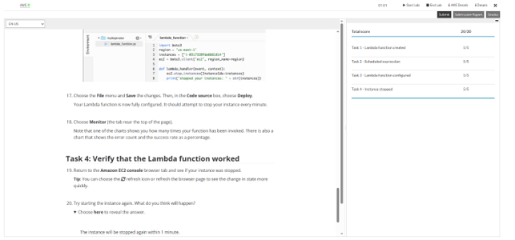
---

## AWS EBS (Module 7)

From the AWS Module 7 lab, I was taught how to create and manage an Amazon EBS volume, attach to an ec2 instance, mount it, and take a snapshot and restore to another volume. The practical application of the block-level storage cemented the basics of scale-out, AWS persistently stored data.

The EBS volumes are very crucial in the case of the City of Vancouver DAP project within the context of fault-tolerant data-processing infrastructure. To better understand this, let us consider an example where high-volume analytics or data wrangling within the EC2-based transformation setup or Glue jobs is deployed temporarily; the EBS volumes would be used as high-performance attachable infrastructure to store intermediary data. Snapshotting and restore are consistent with the way we address versioning and recoverability of all three raw, clean, and curated S3 buckets. In case of ETL failure or some kind of unwanted overwrites, EBS-backed environments (or other fast workloads) with snapshots enable us to do the rollback and lose no data within a very short period of time. To add value to this lab, the site required safe and recoverable storage across the pipeline.

Figure 20 Case Study #12: Working with Amazon EBS: Lab 4

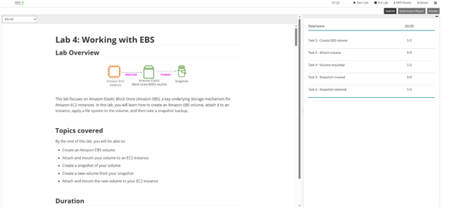

---

## Conclusion

The project successfully demonstrated secure, scalable, and cost-effective HR analytics using AWS. Every lab module and AWS service aligns with a real component of the City of Vancouver's DAP initiative—from S3 data lakes to IAM roles, Glue pipelines, and serverless operations with Lambda.
